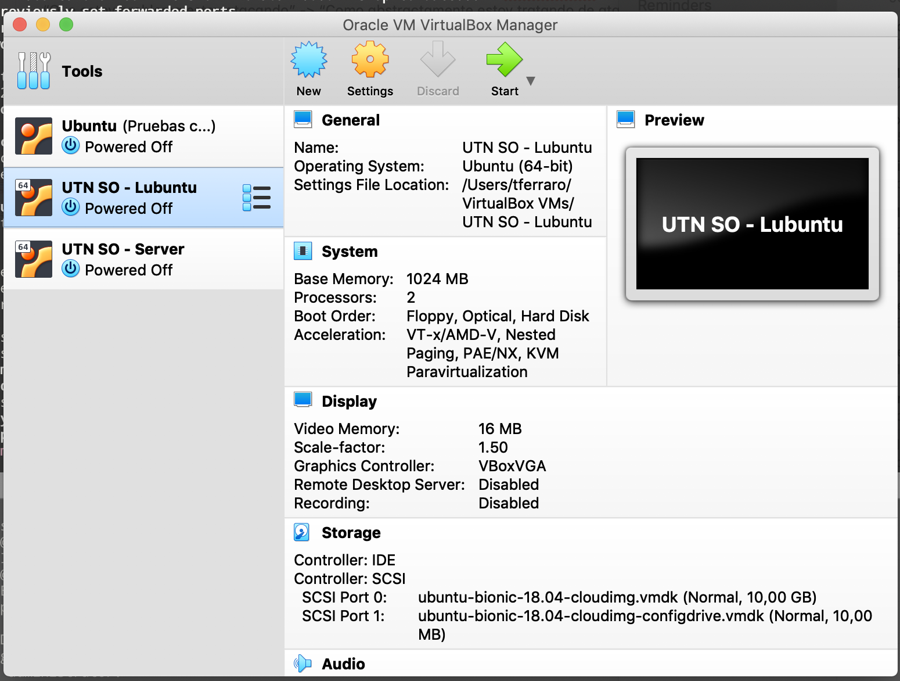
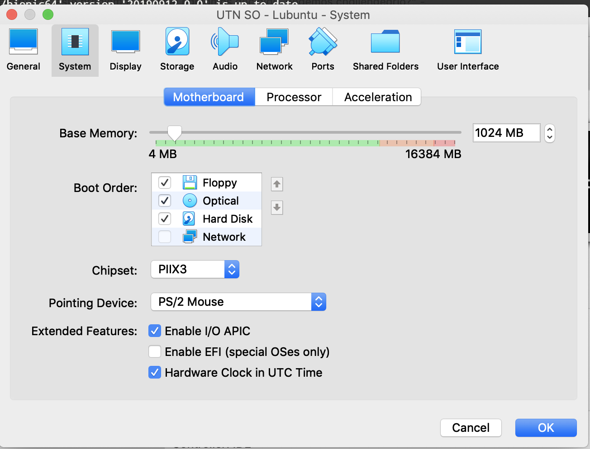
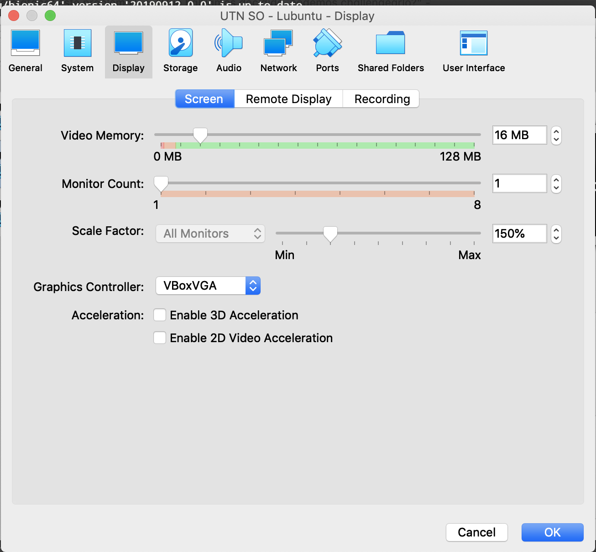
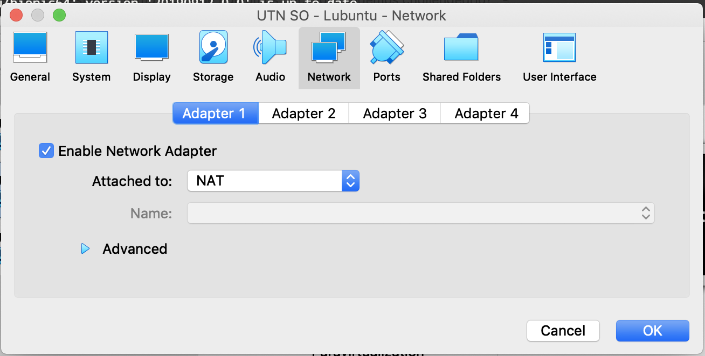

# VM de Sistemas Operativos
A partir de la versión 6.0 de las VMs, no solo pasamos a versionarlas en este repo, sino que deprecamos la necesidad de bajarse múltiples zips para poder usarla!

Tengan en cuenta que seguirán funcionando sobre VirtualBox.

Este repo contiene todas las instrucciones para que la herramienta Vagrant pueda armar tanto la máquina virtual "server", como la de entorno de desarrollo con interfaz gráfica!

### Qué cambios grosos vienen con la versión +6.0?
- Las VMs **son de 64bits**, por lo que ya no se soportan más Sistemas Operativos "anfitriones" (ej Windows) de 32bits. (Hace ya 15 años que todos los procesadores son de 64bits, era hora que migremos).
- Usamos la distro Ubuntu 18.04 LTS, actualizándonos a los últimos paquetes.
- Las VMs se van a **armar** (*provision*) una única vez mediante la herramienta Vagrant.

## Cómo instalamos la VM?
Nota: Cuando hablamos de la _"consola"_ en Windows, estamos hablando de la línea de comandos del sistema. Si bien depende mucho de la configuración de cada computadora, asegúrense de ejecutarla **como administrador**.

### Instalá VirtualBox y Vagrant

[VirtualBox] es el software de virtualización que usaremos para correr la VM. Pueden descargarlo e instalarlo desde [https://www.virtualbox.org/](https://www.virtualbox.org/). **Importante**: Si tenes una versión de Vagrant menor a la 2.2.7, solo están soportadas hasta la versión 6.0 de Virtualbox.

Por otro lado, [Vagrant](https://www.vagrantup.com/) es una herramienta que permite armar máquinas virtuales desde contenedores (llamadas cajas) de una VM ya prefabricada y configurarla para con un solo comando, tenerla corriendo y lista para usarse, entre otras de las cuantas funcionalidades que tiene.

Para instalarlo, primero descargalo desde: [https://www.vagrantup.com/downloads.html](https://www.vagrantup.com/downloads.html). Una vez instalado, vagrant va a estar configurado para que podamos acceder desde la consola (si, incluso en windows!).

Pero antes de usarlo, primero necesitamos bajar un plugin para que corra bien, por lo que posicionados en la carpeta de este repo, escribimos en la consola `vagrant plugin install vagrant-reload`.

### Creá la Máquina Virtual
Soportamos 2 sabores (*flavors*) de máquinas virtuales: la `server` y la `lubuntu` con interfaz gráfica, siendo esta última el flavor por *default*. 

Para poder crear por primera vez una máquina virtual con vagrant, vamos a tener que hacer uso del comando `vagrant up`, que creará la VM y le instalará todos los paquetes y programas necesarios.

Para elegir manualmente el flavor, solo hace falta mencionarlo como `vagrant up <flavor>`. Ejemplo: `vagrant up server`.

Este comando va a crear la VM y dejarla corriendo, pero sin pantalla gráfica visibile. Para abrirla solo necesitamos abrir VirtualBox y hacer doble click sobre la VM:

En el caso de que encuentren un error donde el provider de virtualización sea HyperX, a los comandos de vagrant agregar `provider=virtualbox`, para asegurarnos que se esté creando en virtualbox.

### Configurar la Máquina Virtual según tu PC
Cada pc tiene diferentes recursos disponibles, por lo que por defecto estas VMs se crean con 1GB de RAM y 16MB de memoria de video. Si tenés una máquina más potente y poder asignarle mayores recursos, podes modificarlos haciendo click-derecho sobre la VM y Configuraciones (Settings):

#### Conexión de Red
Por defecto la máquina virtual se crea en una red privada que se engancha del internet de la máquina anfitrión para funcionar (tipo **NAT**). Eso implicará que máquinas ajenas a la máquina anfitrión no podrán conectarse a la VM.

Dado que nuestro trabajo práctico suele tener módulos interactuando entre computadoras, en esos casos es necesario cambiar la conexión a **Adaptador Puente** (*Bridged Adapter*). Esto provocará que cada máquina virtual se convierta en un elemento de la red local del anfitrión y todas las virtuales puedan verse en la misma red.

### Problemas Comunes
> `No usable default provider could be found for your system.`

Este mensaje suele aparecer cuando el usuario de Windows no tiene los suficientes permisos. Volvé a ejecutar la consola como administrador.

©2019 Sistemas Operativos UTN FRBA
